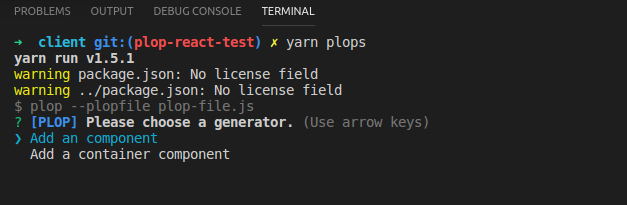

# plop-react
A [plop](https://plopjs.com/) generator for creating React components in accordance with SG guidelines.
It allows to create 2 kind of React components:
* React Component: Simple component with the following folder structure:
    * `<Component name>.component.js`
    * `<Component name>.style.js`
    * `<Component name>.test.js`
    * `index.js`
* React Container (or View): Component with the boilerplate for mapping application state to component's props by using [Redux](https://redux.js.org/) (`mapStateToProps &  mapDispatchToProps`).
    * `<Component name>.container.js`
    * `<Component name>.component.js`
    * `<Component name>.style.js`
    * `<Component name>.test.js`
    * `index.js`

For each one of these 2 kind of component, you can choose:
* which React component to use: `PureComponent Class`, `Component Class` and `Stateless Function`
* to use [ReactIntl](https://github.com/yahoo/react-intl) or not (multilingualism)
* to use [Flow](https://flow.org/) or not (Type checker)

See [Examples](./examples)

# Get Started

## Installation

1. Add Plop to your project

```
$ npm install --save-dev plop
```

2. Add Plop-react to your project

```
$ npm install --save-dev @sgfastit/plop-react
```

3. Create a plopfile.js at the root of your project
``` javascript
module.exports = function (plop) {
	// Load plop react here
  plop.load('plop-react');

  // You can load other plop module or define your own plop generators or helpers, here
};
```

4. Add script inside your `package.json`, for running `plop` generator
```
"plops":"plop --plopfile plopfile.js"
```

5. Now you can use it, by running

```
yarn plops
```



## Configuration

### Default confguration

By default, Plop-react has default configurations:

``` javascript
{
  componentsPath: './source/components',    // default location for components
  containersPath: './source/containers',    // default location for containers
  defaultComponentName: 'Button',           // default name for component
  defaultContainerName: 'Form',             // default name for containers
  defaultComponentType: 'PureComponent Class',  // use PureComponent Class by default
  useReactIntlByDefault: true,              // use ReactIntl by default
  useFlowByDefault: true,                   // use Flow by default
};

```

### How to overwrite default configuration

You can overwrite the whole default configuration (or only some properties) by yours when you load `plop-react` inside your `plop-file.js`.

``` javascript
module.exports = function(plop) {
  // Load plop react here and overwrite default configuration
  plop.load('plop-react', {
    componentsPath: './src/components',
    containersPath: './src/views',
    defaultComponentName: 'Component',
    defaultComponentType: 'PureComponent Class',
    useFlowByDefault: false,
  });
};
```
